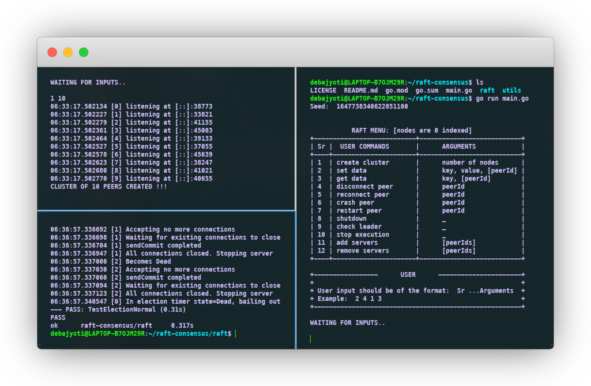
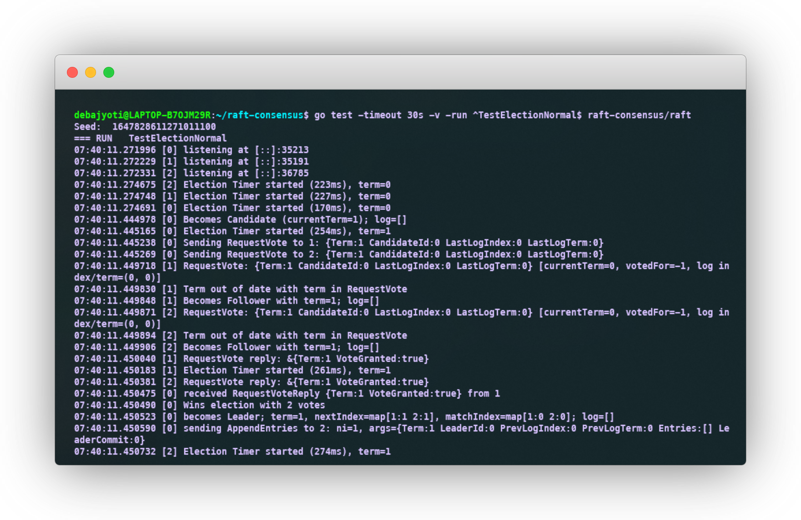
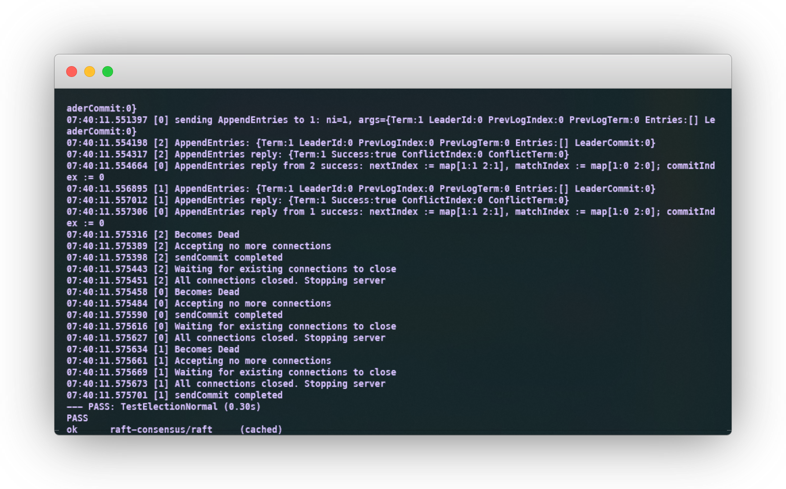
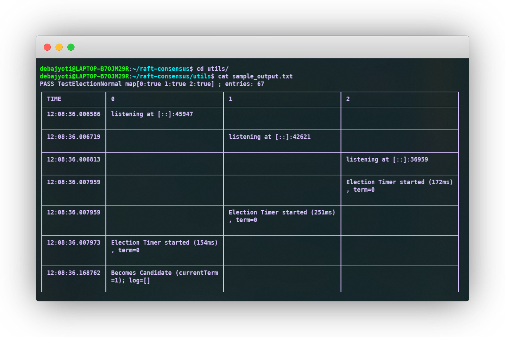

# Raft Consensus Algorithm

<div id="top"></div>
<!--
*** Thanks for checking out the Best-README-Template. If you have a suggestion
*** that would make this better, please fork the repo and create a pull request
*** or simply open an issue with the tag "enhancement".
*** Don't forget to give the project a star!
*** Thanks again! Now go create something AMAZING! :D
-->

<!-- PROJECT SHIELDS -->
<!--
*** I'm using markdown "reference style" links for readability.
*** Reference links are enclosed in brackets [ ] instead of parentheses ( ).
*** See the bottom of this document for the declaration of the reference variables
*** for contributors-url, forks-url, etc. This is an optional, concise syntax you may use.
*** https://www.markdownguide.org/basic-syntax/#reference-style-links
-->

[![Contributors][contributors-shield]][contributors-url]
[![Forks][forks-shield]][forks-url]
[![Stargazers][stars-shield]][stars-url]
[![Issues][issues-shield]][issues-url]
[![MIT License][license-shield]][license-url]
[![LinkedIn][linkedin-shield]][linkedin-url]

<!-- PROJECT LOGO -->
<br />
<div align="center">
  <a href="https://github.com/debajyotidasgupta/raft-consensus">
    
  </a>

  <h3 align="center">Raf Consensus</h3>

  <p align="center">
    A prototype for demonstrating the raft consensus algorithm.
    <br />
    <a href="https://github.com/debajyotidasgupta/raft-consensus/wiki"><strong>Explore the docs »</strong></a>
    <br />
    <br />
    <a href="https://github.com/debajyotidasgupta/raft-consensus">View Demo</a>
    ·
    <a href="https://github.com/debajyotidasgupta/raft-consensus/issues">Report Bug</a>
    ·
    <a href="https://github.com/debajyotidasgupta/raft-consensus/issues">Request Feature</a>
  </p>
</div>

<!-- TABLE OF CONTENTS -->
<details>
  <summary>Table of Contents</summary>
  <ol>
    <li>
      <a href="#about-the-project">About The Project</a>
      <ul>
        <li><a href="#built-with">Built With</a></li>
      </ul>
    </li>
    <li>
      <a href="#getting-started">Getting Started</a>
      <ul>
        <li><a href="#prerequisites">Prerequisites</a></li>
        <li><a href="#installation">Installation</a></li>
        <li><a href="#setting-debug-level">Setting DEBUG level</a></li>
      </ul>
    </li>
    <li><a href="#project-details">Project Details</a></li>
    <li><a href="#usage">Usage</a></li>
    <li><a href="#license">License</a></li>
    <li><a href="#contact">Contact</a></li>
    <li><a href="#acknowledgments">Acknowledgments</a></li>
  </ol>
</details>

<!-- ABOUT THE PROJECT -->

## About The Project



This project demonstrates the implementation of the `Raft Consensus algorithm` which is a consensus bases protocol for distributed systems. This project is built as a part of the course `CS60002` **_Distributed Systems_** at Indian Institute of Technology, Kharagpur. This project implements a simple version of the raft protocol, which can be used as a base template to build your own distributed system by adding features. Following are the core features implemented in this projects:

- Raft Consensus RPCs
  - `RequestVote` RPC
  - `AppendEntries` RPC
- Raft Log
  - `Log` class
- Raft State Machine
  - `StateMachine` (a simple state machine)
- Raft Leader Election
  - `LeaderElection` RPC
- Raft Consensus
  - `RaftConsensus` class
- `Membership Change` Feature
- Visualization with `timing diagram`
- Single `client interface` for testing the features

A single client interface was built mainly because this is a simple working protoype and not industrial-strength distributed system. The client interface is a simple command line interface which can be used to test the features of the project. All the RPCs are implemented in accordance with [In Search of an Understandable Consensus Algorithm](https://raft.github.io/raft.pdf) by Diego Ongaro and John Ousterhout. This implementation of the raft can be used as a base model and can be extended to build your own distributed system by adding advanced features and implementing multiple client gateway.

<p align="right">(<a href="#top">back to top</a>)</p>

### Built With

Following mentioned are the major frameworks/libraries used to bootstrap this project. Leave any add-ons/plugins for the acknowledgements section. Here are a few examples.

- [Golang](https://go.dev/)
  - [Leak Test](github.com/fortytw2/leaktest) - _Required for memory leak testing_
  - [Pretty Tables](github.com/jedib0t/go-pretty) - _Used in Timing Diagram visualization_
  - [net/rpc](https://pkg.go.dev/net/rpc) - _Wrappers required for building Raft RPCs_
- [Shell Script](https://www.javatpoint.com/shell-scripting-tutorial)

<p align="right">(<a href="#top">back to top</a>)</p>

## Project Details

Following are the details of the file structure of this project:

```
raft-consensus
├──── LICENSE
├──── README.md
├──── go.mod
├──── go.sum
├──── images
│     └── logo.png
│     └── overall.png
│     └── test1.png
│     └── test2.png
│     └── timing.png
├──── main.go
├──── raft
│     ├── config.go
│     ├── raft.go
│     ├── raft_test.go
│     ├── server.go
│     ├── simulator.go
│     └── storage.go
└──── utils
      ├── viz.go
      ├── visualize.sh
      ├── sample_logs.txt
      └── sample_output.txt
```

Following are the details of the file structure and their functionalities that are present in this code base.

- **raft/server.go** - _This file contains all the necessary code for implementing servers in a network using TCP along with various Remote Procedural Calls_
  - `Server struct` - Structure to define a service object
  - `Server` methods - Methods to implement the server
    - **_CreateServer\:_** create a Server Instance with serverId and list of peerIds
    - **_ConnectionAccept\:_** keep listening for incoming connections and serve them
    - **_Serve\:_** start a new service
    - **_Stop\:_** stop an existing service
    - **_ConnectToPeer\:_** connect to another server or peer
    - **_DisconnectPeer\:_** disconnect from a particular peer
    - **_RPC\:_** make an RPC call to the particular peer
    - **_RequestVote\:_** RPC call from a raft node for RequestVote
    - **_AppendEntries\:_** RPC call from a raft node for AppendEntries
- **raft/raft.go** - This file contains the implementation of the Raft Consensus algorithm
  - `RNState` - Enum to define the state of the Raft Node
    - **_Follower\:_** Follower state
    - **_Candidate\:_** Candidate state
    - **_Leader\:_** Leader state
    - **_Dead\:_** Dead/Shutdown state
  - `CommitEntry` - Structure to define a commit entry
    - **_Command\:_** Command to be executed
    - **_Term\:_** Term in which the command was executed
    - **_Index\:_** Index of the command in the log
  - `LogEntry` - Structure to define a log entry
    - **_Command\:_** Command to be executed
    - **_Index\:_** Index of the command in the log
  - `RequestVoteArgs` - Structure to define the arguments for RequestVote RPC
    - **_Term\:_** Term of the candidate requesting vote
    - **_CandidateId\:_** Id of the candidate requesting vote
    - **_LastLogIndex\:_** Index of the last log entry
    - **_LastLogTerm\:_** Term of the last log entry
  - `RequestVoteReply` - Structure to define the reply for RequestVote RPC
    - **_Term\:_** Term of the leader
    - **_VoteGranted\:_** Vote granted or not
  - `AppendEntriesArgs` - Structure to define the arguments for AppendEntries RPC
    - **_Term\:_** Term of the leader
    - **_LeaderId\:_** Id of the leader
    - **_PrevLogIndex\:_** Index of the previous log entry
    - **_PrevLogTerm\:_** Term of the previous log entry
    - **_Entries\:_** List of log entries
    - **_LeaderCommit\:_** Index of the leader's commit
  - `AppendEntriesReply` - Structure to define the reply for AppendEntries RPC
    - **_Term\:_** Term of the leader
    - **_Success\:_** Success or not
    - **_ConflictIndex\:_** Index of the conflicting log entry
    - **_ConflictTerm\:_** Term of the conflicting log entry
  - `RaftNode` - Structure to define a raft node
    - **_id\:_** Id of the raft node
    - **_peerList\:_** List of peers
    - **_state\:_** State of the raft node
    - **_currentTerm\:_** Current term of the raft node
    - **_votedFor\:_** Id of the candidate voted for in the current term
    - **_CommitIndex\:_** Index of the last committed entry
    - **_lastApplied\:_** Index of the last applied entry
    - **_Log\:_** Log of the raft node
    - **_NextIndex\:_** Next index of the follower
    - **_MatchIndex\:_** Match index of the follower
    - **_server\:_** Server object of the raft node
    - **_db_\:\_** Database object of the raft node
    - **_commitChan\:_** Channel to send the commit index of logs to the state machine
    - **_newCommitReady\:_** Internal channel used to notify that new log entries may be sent on commitChan
    - **_trigger\:_** Trigger AppendEntries RPC when some relevant condition is met
    - **_electionResetEvent\:_** Last time at which the election timer was reset
  - `Raft utility` functions
    - **_sendCommit\:_** Send the commit index to the state machine
    - **_runElectionTimer\:_** Reset the election timer
    - **_electionTimeout\:_** Set Election timeout
    - **_startElection\:_** Start an election
    - **_becomeLeader\:_** helper function to become the leader
    - **_leaderSendAEs\:_** Send AppendEntries RPCs to all the followers in the cluster and update Node
    - **_lastLogIndexAndTerm\:_** Get the last log index and term
    - **_AppendEntries\:_** Send AppendEntries RPCs to all the followers
    - **_RequestVote\:_** Send RequestVote RPCs to all the peers
    - **_becomeFollower\:_** helper function to become the follower
    - **_restoreFromStorage\:_** Restore the state of the raft node from storage
    - **_readFromStorage\:_** Read the state of the raft node from storage
    - **_Submit\:_** Submit a command to the raft node
    - **_Stop\:_** Stop the raft node
    - **_Report\:_** Report the state of the raft node
- **raft/simulator.go** - _This file contains all the necessary code to setup a cluster of raft nodes, interact with the cluster and execute different commands such as read, write and config change on the cluster._
  - `ClusterSimulator` struct - Structure to define a Raft cluster
  - `Simulator` methods - Methods to implement the cluster
    - **_CreateNewCluster\:_** create a new Raft cluster consisting of a given number of nodes and establish
    - connections between them
    - **_Shutdown\:_** shut down all servers in the cluster
    - **_CollectCommits\:_** reads channel and adds all received entries to the corresponding commits
    - **_DisconnectPeer\:_** disconnect a server from other servers
    - **_ReconnectPeer\:_** reconnect a disconnected server to other servers
    - **_CrashPeer\:_** crash a server and shut it down
    - **_RestartPeer\:_** restart a crashed server and reconnect to other peers
    - **_SubmitToServer\:_** submit a command to a server
    - **_Check_Functions\:_** auxiliary helper functions to check the status of the raft cluster: CheckUniqueLeader, CheckNoLeader and CheckCommitted
- **raft/raft_test.go** - _This file has a set of test functions designed to test the various functionalities of the raft protocol. The tests can be designed into 3 major classes:_
  - **_Tests to check Leader Election_**
  - **_Tests to check Command Commits_**
  - **_Tests to check Membership Changes_**
- **raft/config.go** - _This file has a custom implementation of a Set Data Structure as it is not provided inherently by Go. This implementation is inspired by [Set in Golang](https://golangbyexample.com/set-implementation-in-golang/). It provides the following functions:_
  - **_makeSet\:_** make a new set of type uint64
  - **_Exists\:_** check if an element exists in the set
  - **_Add\:_** add a new element to the set
  - **_Remove\:_** remove an element from the set
  - **_Size\:_** get the number of elements in the set
- **util/viz.go** - _This file contains the visualization functions for the raft protocol. It is used to visualize the raft protocol's timing diagram_
  - **ParseTestLog\:\_** parse the log file and return the list of commands
  - **_TableViz\:_** visualize the raft protocol in a table format

<p align="right">(<a href="#top">back to top</a>)</p>

<!-- GETTING STARTED -->

## Getting Started

To get a local copy up and running follow these simple steps.

### Prerequisites

- **Go**  
  To run the code in this Assignment, one needs to have Go installed in their system. If it is not
  already installed, it can be done by following the steps in [Install Go Ubuntu](https://www.tecmint.com/install-go-in-ubuntu/#:~:text=To%20download%20the%20latest%20version,download%20it%20on%20the%20terminal.&text=Next%2C%20extract%20the%20tarball%20to%20%2Fusr%2Flocal%20directory.&text=Add%20the%20go%20binary%20path,a%20system%2Dwide%20installation)

### Installation

_In order to setup a local copy of the project, you can follow the one of the 2 methods listed below. Once the local copy is setup, the steps listed in [Usage](#usage) can be used to interact with the system._

1. Clone the repo
   ```sh
   git clone https://github.com/debajyotidasgupta/raft-consensus
   ```
2. Unzip the attached submission to unpack all the files included with the project.

<p align="right">(<a href="#top">back to top</a>)</p>

### Setting DEBUG level

_In order to obtain logs regarding the execution of Raft algorithm you need to set DEBUG variable as 1 inside raft/raft.go_  
_Similarly if you do not wish to see huge logs and just see the outputs of execution you can set the DEBUG level to 0 (recommended)_

<!-- USAGE EXAMPLES -->

## Usage

Once the local copy of the project has been setup, follow these steps to interact with the system and run tests on the system

### User interaction with the system

_To interact with the system from the console, do the following steps\:_

1.  Open terminal from the main project directory
2.  Run the main go file
    ```sh
    go run main.go
    ```
3.  You will be presented with a menu with necessary commands to create raft cluster, send commands, etc.

### Running tests

_A comprehensive set of tests has been provided in **raft/raft_test.go**. In order to run these tests, do the following steps\:_

1.  To run a particular test execute the following command from the main project directory
    ```sh
    go test -timeout 30s -v -run ^[Test Name]$ raft-consensus/raft
    ```
2.  To run the entire test suite run the following command from the main project directory
    ```sh
    go test -v raft-consensus/raft
    ```




### Visualizing Test Results

_The **utils** directory provides functionalities to cleanly visualize the test logs in the form of a timing diagram table. To visualize the test logs follow the steps below\:_

1. [**_Important_**] Ensure that the DEBUG level is set to 1 in **raft/raft.go**
   ```sh
   const DEBUG = 1
   ```
2. Run a test and save its logs in the utils directory (execute from root project folder `raft-consensus`).
   ```sh
   go test -timeout 30s -v -run ^[Test Name]$ raft-consensus/raft > utils/logs.txt
   ```
3. Use the logs to generate the timing diagram using the **utils/viz.go** file (This is to be executed from inside the `utils` directory)
   ```sh
   cd utils
   go run viz.go < logs.txt > output.txt
   ```

Alternatively, you can use the following command to generate the timing diagram from the logs

1. [**_Important_**] Ensure that the DEBUG level is set to 1 in **raft/raft.go**
   ```sh
   const DEBUG = 1
   ```
2. Run the following command from inside the `utils` directory
   ```sh
   ./visualize.sh -t <test_name>
   ```

- In both cases, the output will be saved in the `utils` directory as `output.txt`
- A sample log file and output file is provided in the `utils` directory.



<p align="right">(<a href="#top">back to top</a>)</p>

<!-- LICENSE -->

## License

Distributed under the MIT License. See `LICENSE.txt` for more information.

<p align="right">(<a href="#top">back to top</a>)</p>

<!-- CONTACT -->

## Contact

| Name               | Roll No.  | Email                        |
| ------------------ | --------- | ---------------------------- |
| Debajyoti Dasgupta | 18CS30051 | debajyotidasgupta6@gmail.com |
| Somnath Jena       | 18CS30047 | somnathjena.2011@gmail.com   |
| Sagnik Roy         | 18CS10063 | sagnikr38@gmail.com          |

<p align="right">(<a href="#top">back to top</a>)</p>

<!-- ACKNOWLEDGMENTS -->

## Acknowledgments

List of resources we found helpful and we would like to give them some credits.

- [The Raft Consensus Algorithm](https://raft.github.io/)
- [In Search of an Understandable Consensus Algorithm](https://raft.github.io/raft.pdf)
- [You Must Build A Raft](https://www.youtube.com/watch?v=Hm_m4MIXn9Q)
- [Practical Distributed Consensus using HashiCorp/raft](https://www.youtube.com/watch?v=EGRmmxVFOfE)
- [Lecture Notes CS60002](https://cse.iitkgp.ac.in/~sandipc/courses/cs60002/cs60002.html)

<p align="right">(<a href="#top">back to top</a>)</p>

<!-- MARKDOWN LINKS & IMAGES -->
<!-- https://www.markdownguide.org/basic-syntax/#reference-style-links -->

[contributors-shield]: https://img.shields.io/github/contributors/debajyotidasgupta/raft-consensus.svg?style=for-the-badge
[contributors-url]: https://github.com/debajyotidasgupta/raft-consensus/graphs/contributors
[forks-shield]: https://img.shields.io/github/forks/debajyotidasgupta/raft-consensus.svg?style=for-the-badge
[forks-url]: https://github.com/debajyotidasgupta/raft-consensus/network/members
[stars-shield]: https://img.shields.io/github/stars/debajyotidasgupta/raft-consensus.svg?style=for-the-badge
[stars-url]: https://github.com/debajyotidasgupta/raft-consensus/stargazers
[issues-shield]: https://img.shields.io/github/issues/debajyotidasgupta/raft-consensus.svg?style=for-the-badge
[issues-url]: https://github.com/debajyotidasgupta/raft-consensus/issues
[license-shield]: https://img.shields.io/github/license/debajyotidasgupta/raft-consensus.svg?style=for-the-badge
[license-url]: https://github.com/debajyotidasgupta/raft-consensus/blob/main/LICENSE
[linkedin-shield]: https://img.shields.io/badge/-LinkedIn-black.svg?style=for-the-badge&logo=linkedin&colorB=555
[linkedin-url]: https://www.linkedin.com/in/debajyoti-dasgupta/
